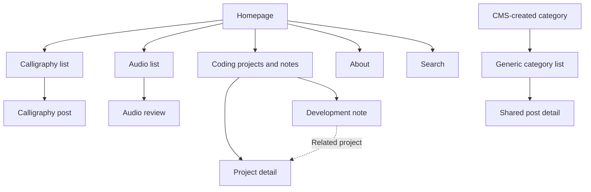
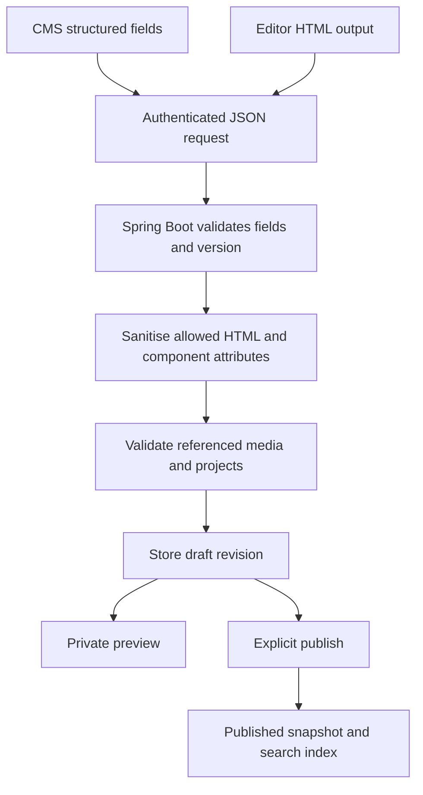
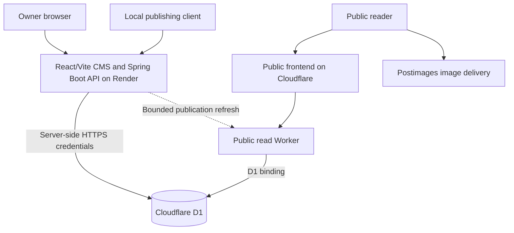

# Personal Homepage and CMS — Requirements

Document date: 2026-09-26  
Status: implementation baseline derived from the project discussion  
Primary deployment: cloud  
Secondary deployment: a separate local-deployment branch

## 1. Purpose and product direction

Build a personal homepage and publishing system combining calligraphy, audio reviews, and software projects. The public website should feel like one coherent personal studio, with consistent typography, components, spacing, images, and interactions across all subjects.

The owner must be able to manage the site through a browser-based CMS from a computer, phone, or tablet. Spring Boot is a deliberate part of the project because learning to build a Spring Boot application is a primary objective. The project must not remove Spring Boot merely to simplify deployment.

The primary implementation is cloud based. A separate local-deployment branch must provide a locally runnable version with equivalent core editorial functionality. Local operation and publishing local content to the cloud are related but distinct capabilities.

This document defines requirements and acceptance criteria. It does not require an example HTML implementation, a final visual mockup, deployment, or infrastructure provisioning at this stage.

## 2. Requirement conventions and decision status

- **Must / required:** required behaviour for the implementation baseline.
- **Should:** preferred behaviour; departures must be documented with reasons.
- **May / optional:** an extension that must not block the first complete version.
- **Implementation choice:** a decision to make during implementation without changing the product requirements.

### 2.1 Confirmed decisions

| Area | Decision |
| --- | --- |
| Product | Personal homepage plus custom CMS |
| Initial subjects | Calligraphy, audio, and coding |
| Backend learning goal | Spring Boot |
| Primary deployment | Cloud-based public site and remotely accessible CMS |
| CMS deployment | React/Vite CMS build served by Spring Boot's embedded web server on Render |
| Secondary deployment | Separate local-deployment branch |
| Cloud database | Cloudflare D1, using SQLite semantics |
| Image hosting | Owner manually uploads to Postimages |
| Media management | CMS stores image URLs, names, metadata, and galleries |
| Cloudflare deployment tooling | Wrangler for the Cloudflare portion |
| Cost objective | No paid Cloudflare services for the baseline; target free external hosting |
| Devices | Desktop, phone, and tablet for both public site and CMS |
| Languages | English and Chinese content and search; internationalised interface |
| Editorial workflow | Drafts, autosave, revision history, preview, explicit publication |
| Appearance | Shared design system with constrained component variations |
| Themes | CMS-managed palettes, site default, reader preference in local storage |
| Navigation | Shallow hierarchy; category and brand filters rather than deeply nested pages |
| Search | Title/body search, categories, date range, chronological and relevance sorting |
| Categories | Database-driven; additions appear without frontend code changes |
| Comments | Site-level default plus per-post control |

### 2.2 Baseline assumptions

These assumptions make the requirements implementable without another planning round. They may be revised deliberately.

- The CMS initially has one owner account; public reader accounts are not required.
- Chinese interface text initially uses Traditional Chinese (`zh-Hant`); English uses `en`.
- Each post can have one or more language versions. Translation is manual, not automatic.
- A quiet editorial/studio visual direction is the starting theme.
- Comments are disabled by default. Public comments can be delivered after the core publishing milestone.
- The baseline does not require an always-warm external Spring Boot server on a free hosting plan.
- Existing custom-domain costs are separate from hosting. Provider-assigned domains must be usable.
- A new category uses an existing content format. New interactive formats can require code changes.

### 2.3 Implementation choices still to resolve

- Frontend framework and CSS implementation; Tailwind and Bootstrap are not mandatory.
- Exact Spring Boot, Java, frontend, and dependency versions, selected from supported releases at implementation time.
- CKEditor build/licensing configuration, or an explicitly documented equivalent editor if cost/licensing blocks the required features.
- Render plan and runtime configuration, after testing its resource and startup constraints.
- Authentication provider or securely implemented owner-account/session mechanism.
- Chinese search tokenisation/indexing strategy, validated against acceptance fixtures.
- Final palette values, font families, and exact layout breakpoints.

## 3. Scope and priorities

### 3.1 Core release

The first complete core release must include:

1. Public homepage, category lists, post detail pages, project pages, and About page.
2. Protected owner CMS available remotely on mobile and desktop.
3. Spring Boot editorial API.
4. D1-backed cloud persistence.
5. Rich-text authoring with controlled media and gallery components.
6. Manual Postimages link registration and media organisation.
7. Draft autosave, revision history, preview, publication, and unpublication.
8. English/Chinese interfaces, language-linked content, and bilingual search.
9. Dynamic categories, audio filters, and shallow navigation.
10. CMS-managed themes and persistent reader palette selection.
11. Portable import/export and authenticated local-to-cloud publishing.
12. Cloud deployment documentation and a documented local-deployment branch.

### 3.2 Subsequent capability

Public comment submission and moderation may follow the core release. The schema and CMS must already represent comment settings. A comments toggle must not advertise an unavailable submission feature: until comments are implemented, the CMS must identify that capability as unavailable rather than displaying a non-functional public form.

### 3.3 Out of scope initially

- Automatic uploads to Postimages or storage of image binaries in D1.
- A general-purpose drag-and-drop website builder.
- Arbitrary CSS, JavaScript, or executable HTML entered into posts.
- Multi-user simultaneous collaborative editing.
- Ecommerce, subscriptions, reader account systems, or social-network features.
- Automatic translation, AI search, or paid search infrastructure.
- Running the portfolio's individual software projects inside the CMS application.
- Hosting Spring Boot in Cloudflare Containers while claiming to remain on Cloudflare Free.

## 4. Users and permissions

### 4.1 Public reader

A reader can browse published content, filter and search, select language and palette preferences, visit project links, and use comments only when that feature is implemented and enabled.

Readers must never receive draft content, unpublished revisions, private previews, owner information beyond intentional author metadata, credentials, or administrative configuration.

### 4.2 Owner

The owner can manage posts, translations, media, galleries, categories, tags, brands, themes, site settings, drafts, revisions, imports, exports, and publication state.

### 4.3 Local publishing client

A local publishing client is an authenticated owner tool. It must use the same validation, authorisation, revision, and publication rules as the browser CMS. Local publishing must not bypass the API by writing directly to production D1.

## 5. Information architecture and public routes

### 5.1 Main structure

### 5.2 Route rules

- Public routes should have locale prefixes, for example `/en/` and `/zh-hant/`.
- Category and post URLs must be human-readable and have stable identity behind their slugs.
- Suggested route shapes: `/{locale}/categories/{slug}`, `/{locale}/posts/{slug}`, `/{locale}/projects/{slug}`, and `/{locale}/search`.
- Slug changes must preserve old links through redirects where practical.
- Filters, sorting, and pagination must be represented in URL query parameters.
- Browser Back/Forward and shared search links must restore the same result state.
- API references use stable IDs; URLs may use slugs resolved to those IDs.
- Public pages must have meaningful HTML content available without waiting for a browser-only content fetch. Use server rendering or generation with a defined publication refresh mechanism.

## 6. Public page requirements

### 6.1 Homepage

The homepage must include:

1. Site identity, navigation, search access, language selection, and theme access.
2. Short owner introduction.
3. Optional featured post or project.
4. Curated/latest calligraphy entries.
5. Curated/latest audio entries.
6. Curated/latest coding entries.
7. Footer with About and configured external links.

Each content section links to its complete list. Sections must look intentional with one or two entries and must not require a full grid to avoid empty placeholders. Empty sections may be hidden.

CMS homepage configuration should support selecting visible categories, their order, entry limits, and optional featured entries. Creating a category must not automatically overcrowd the homepage or navigation.

### 6.2 Navigation

- Use an editorial masthead or compact studio header as the baseline direction.
- Do not impose a Bootstrap appearance merely because a CSS framework is used.
- Desktop navigation may show the primary categories and About directly.
- Mobile navigation must provide accessible menu, search, language, and theme controls.
- Navigation must work by touch and keyboard and cannot depend on hover.
- No permanent global sidebar is required.
- Long articles may have a table of contents; on narrow screens it collapses above the body.
- Related links belong primarily at the article end, with a small bounded count.

### 6.3 Category and archive lists

- Show category title, description, cards, filters, sorting, pagination, and clear empty states.
- Use the same list template for CMS-created categories.
- Audio supports equipment-type filters such as IEM and DAC, plus brand filters.
- Calligraphy may use script, material/tool, and series tags.
- Coding supports project/note format and technology filters.
- Inapplicable filters must not appear as irrelevant controls on other categories.

### 6.4 Shared article shell

All article formats share breadcrumbs, title hierarchy, introduction, author/date treatment, reading width, body spacing, captions, tags, related entries, and comment positioning.

Metadata includes published date, optional updated date, author, category, and locale. Store full timestamps; exact time need not be displayed by default.

### 6.5 Format-specific content

| Format | Required capabilities |
| --- | --- |
| Journal/calligraphy | Images, galleries, captions, reflections, optional materials/tools |
| Audio review | Product/model, brand, equipment type, listening setup, narrative, comparisons |
| Project | Description, screenshots, status, technology tags, live URL, repository URL, reflections |
| Development note | Rich text, code blocks, optional related-project reference |

Numerical review scores are optional and must not be forced into every audio review.

Project pages are stable records that can evolve. Development notes can link to them. Live software projects remain independently deployed; editing a post must not redeploy those applications.

## 7. Shared design system

### 7.1 Design principles

- Quiet editorial presentation, strong readability, and restrained decoration.
- Consistent components across all categories.
- Variations are named and intentional, not arbitrary per-element values.
- Galleries can be wider than reading text without changing the entire article template.
- Artwork must not be forcibly cropped in article display.

### 7.2 Tokens and component variants

Define shared tokens for typography, spacing, radii, borders, colours, shadows, content widths, focus states, and motion.

Suggested starting spacing scale: 4, 8, 12, 16, 24, 32, 48, and 64 CSS pixels. These are implementation defaults, not mandatory exact visual values.

Required semantic choices include:

- Padding: compact, standard, spacious.
- Radius: small, medium, large; pill reserved for suitable labels/controls.
- Text: heading, body, muted, caption, code.
- Width: reading, standard, wide.
- Card: article, artwork, project.
- Button/link: primary, secondary, quiet, destructive where applicable.
- Image: inline, wide, full artwork, gallery.
- Table: standard, compact, comparison.

An author must not need to type pixel values or CSS to select these variants. Changes to shared tokens must update all corresponding components.

## 8. Themes and palette management

### 8.1 Palette records

The CMS must allow creating, editing, previewing, publishing, disabling, and selecting a default palette. Each palette has a stable ID, name, schema version, published version, base colours, optional derived-token overrides, and availability status.

Baseline five input roles:

| Role | Use |
| --- | --- |
| Background | Page canvas |
| Surface | Cards, panels, menus |
| Text | Main foreground |
| Primary accent | Links, selected controls, main actions |
| Secondary accent | Supporting highlights |

### 8.2 Derived colours

Generate muted text, subtle/elevated surfaces, borders, hovered/pressed colours, text-on-accent, focus rings, and selection backgrounds from the base palette.

- Use a documented, consistent colour derivation method.
- Do not assume a fixed opacity or lightness adjustment always produces readable text.
- Validate foreground/background pairs against accessibility contrast targets.
- Provide explicit overrides for derived colours that cannot meet readability requirements.
- Retain independent semantic error, warning, and success roles.
- Theme preview must include text, cards, tables, code, buttons, forms, disabled controls, and focus states.
- Publishing a theme must not require rebuilding each article.
- Article content stores semantic styles, not theme-specific colour literals.

### 8.3 Reader preferences

- Readers can select any enabled published palette or choose “Use site default”.
- Persist the selected palette ID in local storage without requiring an account.
- Resolve preference in this order: valid reader choice, CMS default, built-in fallback.
- If a palette is removed or disabled, fall back without a broken page.
- Apply the preference early enough to minimise a flash of the wrong palette.
- Handle unavailable local storage gracefully.
- Preference applies across pages and reloads on that browser/device; cross-device syncing is not required.
- Optional future light/dark variants must fit the palette model without rewriting posts.

## 9. Responsive and accessible behaviour

Both the public site and CMS must work on desktop, tablet, and phone.

- Layout changes should be driven by available space, not device-name detection.
- Cards reduce columns on narrower viewports.
- Article text remains readable without page-level horizontal scrolling.
- Galleries preserve image proportions and reduce columns appropriately.
- Wide tables and code may scroll within their own containers.
- Search filters collapse into an accessible panel when necessary.
- CMS post settings move from a side panel to a mobile-accessible panel or section.
- Editor controls remain usable with touch, a virtual keyboard, and smaller screens.
- No essential feature requires hover or drag-and-drop alone.
- Keyboard focus must be visible; dialogs must handle focus and dismissal correctly.
- Controls require accessible names and sufficient touch areas.
- Images require meaningful alt text or an explicit decorative designation.
- Motion must respect reduced-motion preferences.
- Language and theme controls must remain discoverable on mobile.
- Mobile draft save/publish controls must not be obscured by the editor or virtual keyboard.

## 10. CMS screens

### 10.1 Dashboard

Show recent drafts, recently published posts, pending imports or recovery notices, and actionable system errors. Avoid a dashboard dominated by analytics that do not aid publishing.

### 10.2 Post list

Support filtering by draft/published/archived state, category, format, locale, and text. Show title, locale availability, update/publication dates, and whether unpublished changes exist.

### 10.3 Post editor

Separate structured fields from body authoring:

- Title, slug, excerpt.
- Category, format, tags, optional series.
- Author and language.
- Cover image.
- Format-specific details.
- Publication metadata and comment override.
- Rich-text body.
- Save state, preview, revision history, publish, and unpublish actions.

Changing language must select/create a language version, not silently overwrite another version's content.

### 10.4 Media library and galleries

Search and select registered media; add/edit links and metadata; create ordered galleries; show where an asset is used.

The media library must use paginated or virtualised result sets and lazy-load preview thumbnails. A failure in one preview must remain local to that media card and must not replace or break the complete library.

### 10.5 Taxonomy management

Manage categories, translated names/descriptions, tags, brands, equipment types, order, visibility, and archival status.

### 10.6 Themes and site settings

Manage palette records, site default, homepage sections, navigation visibility, site identity, About content, external links, and default comment policy.

### 10.7 Import/export and history

Provide import preview, validation results, conflict choices, export options, revision inspection, and restore-to-draft.

## 11. Rich-text editor and content pipeline

### 11.1 Editor integration

CKEditor 5 is the preferred initial editor candidate. It is embedded inside the CMS; it is not the CMS, backend, database, or public article renderer.

The selected setup must support headings, paragraphs, inline emphasis, links, lists, quotes, code blocks, tables, image insertion, captions, and required custom content components.

Verify licensing and feature availability before committing to a build. Paid editor features must not be silently introduced. If the required zero-cost configuration is unsuitable, document the replacement decision; Tiptap's open-source core is a candidate, not an automatic stack change.

### 11.2 Controlled components

Required custom/editor-integrated components:

- Gallery reference with preset layout, width, spacing, and caption visibility.
- Media-library image with preset display mode.
- Callout/note with approved appearance variants.
- Project reference/card.

Tables represent tabular information. Galleries/grids represent visual layouts. Layout tables must not become the default mechanism for arranging arbitrary page content.

Manually typed shortcodes are not the main authoring interface. Optional shortcuts may create the same structured components, but there must be only one authoritative saved representation for each component.

### 11.3 Authoritative save pipeline

- Browser validation provides feedback; server validation is authoritative.
- With CKEditor, store sanitised, round-trippable HTML and approved custom component metadata.
- Do not persist the editor's private internal runtime state as the portability contract.
- Maintain a content schema version for migration and export.
- Reject unsupported executable content and unsafe URLs.
- Preserve intended tables, captions, and custom components through save/reload.
- Prefer explicit validation errors to silently discarding meaningful unsupported content.
- Store external media references using stable media IDs, so URL replacement does not require editing every article.
- Derive plain text from validated content for search; do not search raw HTML markup.
- Public rendering must resolve approved components using the shared design system and must not load CKEditor.
- Private preview must use the same content rendering rules as the public page.

## 12. Media and galleries

### 12.1 Owner workflow

1. Upload an image to Postimages outside the CMS.
2. Copy its direct image URL.
3. Register it in the CMS with a name and metadata.
4. Add it to galleries or insert it into a post.
5. Preview and publish the article.

### 12.2 Media fields

Each media asset must support a stable ID, display name by locale, direct image URL, optional thumbnail URL, optional source-page URL, alt text by locale, default caption by locale, optional dimensions, optional credit, and created/updated timestamps.

- Validate URL structure and supported protocols.
- Distinguish a direct image URL from a hosting page URL in the interface.
- Support batch URL entry and CSV metadata import.
- Permit a second optional bulk input containing Postimages "Thumbnail for websites" HTML. Parse, sanitise, and discard the supplied markup after extracting the anchor URL, thumbnail image URL, and proposed alt/name text. Never save or render the pasted HTML as article content.
- Prefer the Postimages website HTML format over BBCode for this import path. BBCode import is not required for the baseline.
- Reconcile thumbnail records with CSV assets before committing. Display unmatched, duplicate, and ambiguous records for owner correction rather than guessing silently.
- Show preview and loading/error states.
- A failed image must not collapse or break the surrounding article layout.
- Use dimensions where available to reduce layout movement.
- Lazy-load appropriate non-critical images.
- Bound preview loading through pagination or virtualisation and a small concurrent-request limit. Import database writes must be processed in bounded, retry-safe chunks.
- Do not require remote URLs to be fetched during every save; if server-side checks are implemented, restrict outbound requests to prevent unsafe fetching.

### 12.3 CSV empty-row and generated-name rules

- Ignore completely blank CSV rows without reporting an error.
- A non-empty row without a valid direct image URL cannot create a media asset. Mark it as skipped with a row-level validation explanation.
- Missing optional metadata must not fail an otherwise valid image row.
- Assign one immutable import identifier to each accepted asset. It consists of the UTC import timestamp plus a zero-padded sequence number allocated once for that asset. All generated locale names for the asset must reuse exactly that identifier.
- Allocate identifiers centrally for the import batch; do not calculate English and Chinese sequence numbers independently. Preview, retry, and chunk boundaries must preserve the allocation so numbers cannot drift or be reused for different images.
- If an English name is missing but a Chinese name exists, generate the English name as `zh_image/{gallery-slug-or-ungrouped}_{utc-timestamp}_{sequence}`.
- If a Chinese name is missing but an English name exists, generate the Chinese name as `en_image/{gallery-slug-or-ungrouped}_{utc-timestamp}_{sequence}`.
- If both locale names are missing, generate both using `image/{gallery-slug-or-ungrouped}_{utc-timestamp}_{sequence}`. The two names share the same identifier.
- Generated names are editable during import preview. A later manual rename must not change the asset's stable ID or import identifier.

### 12.4 Galleries

- A gallery has a stable ID, name, optional description, and ordered items.
- An asset can belong to multiple galleries.
- Gallery items support per-placement caption overrides and ordering.
- Reordering must have touch/keyboard alternatives to dragging.
- Articles reference gallery IDs and presentation presets.
- Artwork defaults to complete-image display; cropping may be allowed for card thumbnails only through explicit presentation rules.
- A lightbox/larger-image view should support keyboard and touch operation.
- Deleting an in-use asset/gallery must require reassignment or archival; never silently break references.

### 12.5 Shared-reference behaviour

For the baseline, media URL corrections and gallery changes are shared changes: saving them can affect every published article referencing the record. The CMS must show affected usage and make that consequence explicit.

An article revision restores its media/gallery references and layout settings, not an historical copy of externally hosted image bytes. Full historical gallery snapshots are optional and must not be implied by article revision history.

## 13. Content model and relationships

The following is a logical model, not a final migration script.

| Entity | Responsibilities |
| --- | --- |
| Author/owner | Identity and public author metadata |
| Post | Stable identity, primary category, format, author, shared settings |
| Post translation | Locale, stable translation identity, draft head, published revision pointer |
| Revision | Immutable validated title/body/excerpt/slug and applicable metadata snapshot, timestamp, source, schema version |
| Category | Stable ID, slug, enabled/order/navigation settings |
| Category translation | Localised name and description |
| Tag and tag assignment | Flexible labels linked to posts |
| Brand | Audio brand reference |
| Equipment type | IEM, DAC, and future equipment classifications |
| Review details | Product/model, brand/type relations, listening information |
| Project details | Status, demo/repository URLs, technology references |
| Post relationship | Development note to project, curated related content |
| Media asset | External image reference and shared metadata |
| Gallery and gallery item | Ordered reusable media group |
| Theme | Base palette, generated tokens, overrides, publication state |
| Site settings | Default palette, navigation, homepage, comment defaults |
| Search document/index | Published searchable text and relevant filter fields |
| Comment | Optional public discussion plus moderation state |
| Session/publishing credential | Server-side authentication state |
| Redirect | Previous public slug to current target |

### 13.1 Data integrity

- Use stable opaque IDs; names and slugs must not serve as permanent foreign keys.
- Use UTC timestamps in storage and locale-aware display.
- Enforce locale/slug uniqueness within the chosen route namespace.
- A post must have a primary category; tags and brands are separate dimensions.
- Enforce references and prevent orphaned gallery items, translations, and published pointers.
- Search indexes must be rebuildable from authoritative published records.
- Draft-only changes must not update published metadata or search results.
- Shared fields that affect public output must be explicitly published or clearly documented as shared immediate settings.
- Bound article, import, revision, and media batch sizes to the capabilities of the selected hosting plans.

## 14. Drafts, autosave, history, and publication

### 14.1 Draft versus published state

- Saving a draft never changes the currently published article.
- A language version may have a published revision and newer unpublished edits simultaneously.
- Publishing selects a validated revision as the public snapshot for that language version.
- Unpublishing removes that version from public pages, lists, and search.
- Archiving preserves records for owner access without exposing them publicly.
- Translation publication is independent; publishing English must not implicitly publish a Chinese draft.

### 14.2 Autosave

- Autosave after a short idle interval, proposed default approximately two seconds.
- Do not send a request for every keystroke.
- Display Saving, Saved, Offline/local recovery available, and Save failed states accurately.
- A successful save indicator requires server acknowledgement.
- Retry transient failures without duplicating revisions or overwriting newer content.
- Keep a local recovery copy when practical; identify it by post, locale, and base revision.
- Warn before abandoning unsaved edits when the platform supports it.
- Local recovery is not a substitute for server persistence and is not guaranteed across browser storage eviction.

### 14.3 Concurrent editing

- Every mutation includes an expected version or equivalent concurrency token.
- A stale phone/computer tab must receive a conflict instead of silently overwriting newer edits.
- Offer reload, copy/recover local changes, or explicit conflict resolution.
- Offline recovery must check the latest server version before applying changes.

### 14.4 Revision history

- Store immutable revision checkpoints and author/source/time information.
- Group or coalesce autosave history to avoid retaining every keystroke indefinitely.
- Show a readable revision list and permit inspection of an earlier version.
- Restore an old revision as a new draft; do not rewrite history or silently publish it.
- Preserve current draft heads and publication references during pruning.
- Default retention should keep recent autosave checkpoints, with a bounded policy documented in settings.
- Preserve explicit publication checkpoints unless the owner deliberately removes them through a documented retention/export process.
- Storage monitoring must account for revision growth.

### 14.5 Preview and publication consistency

- Private previews require authentication or short-lived, narrowly scoped preview access.
- Draft responses must not enter public caches or search indexes.
- Publication, its public pointer, and searchable data must remain consistent using D1-supported atomic operations or a documented recoverable publication process.
- Repeated publication requests must not create inconsistent duplicate outcomes.
- Refresh affected list/detail/search caches on publishing, unpublishing, or deleting.
- Define a bounded public refresh delay; target at most 60 seconds under normal operation.
- Cache refresh failure must be visible and retryable. Unpublished content must not remain indefinitely public because of an unbounded cache.

## 15. Internationalisation and bilingual content

### 15.1 Interface translation

- Translate public navigation, controls, labels, empty/error states, dates, and CMS interface text.
- Keep translated strings outside component logic.
- Default locales are `en` and `zh-Hant`.
- Additional locales should be addable without restructuring the database.
- URLs determine the active public locale; stored preference may guide initial entry.
- Do not automatically redirect a reader away from an explicitly selected locale URL.

### 15.2 Content translation

- Link translated versions through the shared post ID.
- Each version has its own title, excerpt, body, slug, and publication history.
- A post may exist in only one language.
- Clearly label fallback/original-language content when a requested translation is unavailable.
- Do not present fallback content as if it were translated.
- Media captions/alt text and taxonomy labels support localisation with documented fallback rules.
- Render appropriate page language metadata and alternate-language links for actually published translations.

### 15.3 Chinese text considerations

- Fonts and line wrapping must support Chinese and mixed Latin text.
- Chinese input-method composition must not be disrupted by autosave or editor shortcuts.
- Traditional/Simplified equivalence is not assumed in the first release; the baseline must preserve and search stored text correctly.
- If script-normalised matching is later added, preserve original content and document matching behaviour.

## 16. Search, filters, and sorting

### 16.1 Public query capabilities

Readers must be able to:

- Search title only, body only, or both.
- Search English, Chinese, and mixed-language queries.
- Search all published languages or filter by locale.
- Filter by category ID, format, tags, equipment type, and brand as applicable.
- Select a publication date range.
- Sort by relevance, newest publication, or oldest publication.
- Navigate paginated results and clear filters.

The baseline date filter uses publication date, not last-edited date. Show that meaning in the interface. Treat selected start/end dates consistently in a configured site timezone; default to Asia/Hong_Kong, while storing UTC timestamps. Convert inclusive date selections into an unambiguous server range.

### 16.2 Search implementation requirements

- D1 supports FTS5, but Chinese matching must be validated rather than assumed.
- Evaluate suitable tokenisation or an auxiliary Chinese search index against realistic fixtures.
- Do not claim bilingual search is complete just because interface strings are translated.
- Index published titles, excerpts, and visible article text, including relevant captions if included in the chosen search scope.
- Exclude markup, private metadata, drafts, and hidden administrative content.
- Weight title matches above equivalent body-only matches for relevance sorting.
- Use a deterministic secondary sort key so pagination remains stable.
- Use parameterised queries, bounded query lengths, and validated sort/filter options.
- Handle malformed full-text syntax as user input rather than exposing SQL errors.
- Avoid unbounded full-table scans for ordinary search once content grows.
- Keep search-index generation/versioning documented and provide a rebuild operation.
- Result snippets and highlighting must be safely rendered.
- With no query, default to newest publication and retain active filters.

### 16.3 Required search fixtures

Include at least:

- English title and body matches with case differences.
- Chinese title and body phrases without spaces.
- Mixed query such as `耳機 DAC`.
- Brand/model tokens containing numbers or punctuation.
- Title-only search excluding a body-only match.
- Date-range boundaries in the site timezone.
- A newly created category appearing in filters without deployment.
- Published versus draft translations of the same post.
- Unpublication removing a result.
- Pagination with equal publication timestamps.

## 17. Dynamic categories and taxonomy

- Fetch enabled category records through the API; do not hardcode the initial three into search/editor forms.
- Category records include stable ID, slug, localised label/description, display order, enabled status, and navigation visibility.
- Category creation must make it available to the editor and search filters after normal data refresh.
- A generic category listing must work without a new frontend deployment.
- Navigation/homepage inclusion is separately configurable.
- Brand and equipment type are filtering dimensions, not mandatory nested category pages.
- Renaming a category must not break post relationships.
- Deleting a category in use requires reassignment; archival is preferable.
- A new category does not imply support for arbitrary new fields or interactive content components.

## 18. Comments

- Site setting defines the default availability; default is disabled.
- Per-post override supports inherit, enabled, or disabled.
- When implemented, disabling closes new submissions; previously approved comments remain visible unless the owner explicitly hides the discussion.
- Display comment dates and moderation state appropriately.
- New anonymous comments should enter moderation before public display.
- Provide owner approve/hide/delete actions and basic abuse controls before enabling public submissions.
- Comment input must be validated and safely rendered.
- If the comment service is unavailable or not implemented, do not show a misleading working form.

## 19. API and security requirements

### 19.1 API visibility and credential boundaries

API URLs are not secrets. Browser clients must be able to reach the API. Private operations are protected through authentication and authorisation.

- Public read endpoints expose only published data.
- Administrative endpoints require the owner session or a scoped publishing credential.
- D1/Cloudflare tokens remain in server-side secrets and never appear in frontend bundles, browser storage, exports, repository files, or logs.
- Wrangler deployment credentials remain in trusted local/CI environments.
- Manual Postimages upload requires no Postimages upload credential in this application.
- No general-purpose public SQL proxy may be exposed.

### 19.2 Browser authentication

- Prefer secure HttpOnly cookies for browser sessions.
- Protect cookie-authenticated mutations against CSRF.
- Restrict CORS to the configured CMS origins if cross-origin deployment is used.
- Define cookie domain/SameSite behaviour for the actual deployment; do not assume cross-site cookies work uniformly on mobile browsers.
- Prefer a same-origin API gateway or a compatible same-site domain layout when necessary.
- Logout invalidates the session; expired sessions must not discard local unsaved work without a recovery path.
- Do not add public account registration by default.
- Apply appropriate rate limits to login and sensitive endpoints.

### 19.3 API contracts

Required resource groups: posts/translations/revisions, publication, media, galleries, taxonomy, themes, settings, search, imports/exports, authentication, and optional comments.

- Maintain an explicit versioned API contract.
- Provide structured validation errors and appropriate HTTP status codes.
- Validate pagination and payload limits.
- Use optimistic concurrency for edits.
- Make import/publish retries safe through request IDs or equivalent idempotency handling.
- Public and administrative response models must be separate where necessary to prevent draft leakage.
- Maintain compatible public-read contracts across cloud and local deployment.

## 20. Cloud deployment architecture

### 20.1 Responsibilities

| Component | Responsibility |
| --- | --- |
| Public frontend | Public routing, rendering, responsive components, language/theme UI |
| CMS frontend | React/Vite build served by Spring Boot on Render; protected authoring interface and owner workflows |
| Spring Boot on Render | Embedded web server, same-origin CMS assets and API, authentication, validation, editorial writes, revisions, publication, imports/exports |
| Public read Worker | Published-only reads/search and optional rendering integration |
| D1 | Durable content, metadata, taxonomy, settings, revisions, search data |
| Postimages | External image delivery |

- Public reading must not depend on the external Spring Boot service being awake.
- Editorial writes must go through Spring Boot, not directly from the browser to D1.
- Package the production React/Vite CMS build into the Spring Boot application and serve it through Spring Boot's embedded web server. Use same-origin CMS API requests unless a later deployment requirement justifies separation.
- A sleeping free Render service can delay the first CMS document request as well as the first API request. The browser must receive a useful loading response where the hosting platform permits it, and the CMS must show accurate recovery/retry states after it loads; documentation must not imply that co-hosting eliminates cold starts.
- The public read Worker should remain small; it is not a second independent editorial backend.
- Shared contracts and fixtures must prevent Java and Worker behaviour from drifting.
- Public rendering may integrate the read service into a frontend Worker rather than require an extra network hop.

### 20.2 D1 access from Java

D1 is a managed service with SQLite semantics, not a remotely mounted SQLite file or ordinary JDBC server. The baseline Java implementation accesses it through the supported HTTP API using server-side credentials.

- Isolate persistence behind repository interfaces.
- Do not assume ordinary Spring Data JPA can be applied unchanged to D1 HTTP access.
- Use explicit migrations and documented SQL compatible with the target service.
- Verify atomic publication and optimistic concurrency with D1's actual supported request/transaction mechanisms.
- Do not store durable state on an ephemeral Java host filesystem.

### 20.3 Cost constraints and availability

As checked on 2026-09-26:

- Cloudflare Containers requires Workers Paid; it is excluded from the free baseline.
- D1 Free has a 500 MB per-database maximum and 5 GB total account storage allowance.
- D1 Free includes 5 million rows read/day and 100,000 rows written/day.
- Those storage limits are unrelated to JVM memory or container RAM.
- Free external hosting can sleep or impose resource limits; its suitability must be verified with the actual application.

Requirements:

- Do not activate paid Cloudflare services without a deliberate scope change.
- Recheck provider limits and pricing at deployment time.
- Document Worker request/CPU limits and external-host constraints in operational instructions.
- Index queries, paginate responses, and bound imports/exports to fit free-plan limits.
- Handle quota/service failures visibly and without corrupting editorial state.
- Do not promise unlimited traffic or guaranteed always-on CMS hosting for zero cost.
- A cold Java start should show an honest connecting/retrying state in the CMS.
- Do not use artificial keep-alive traffic as the baseline hosting strategy.

### 20.4 Deployment process

- Use Wrangler for Cloudflare Workers/assets and D1 migrations/configuration.
- Deploy Spring Boot through the external host's supported Java/container workflow.
- Separate development/staging and production credentials/data.
- Keep secrets out of version control and build output.
- Document schema migration order, compatible API deployment order, and rollback limitations.
- Normal content publication must not require redeploying frontend code or independent projects.

## 21. Local-deployment branch

### 21.1 Branch strategy

- Cloud deployment is the primary line of development.
- Maintain a separate branch for local deployment; suggested name: `local-deployment`.
- This requirements document does not itself create a Git repository or branch.
- Preserve shared frontend, API contracts, content schema, and business rules wherever possible.
- Prefer deployment profiles and repository adapters over divergent copies of business logic.
- Document how shared fixes flow from the cloud line into the local branch.

### 21.2 Local runtime

The local branch must run the public frontend, CMS, Spring Boot backend, and local persistence without requiring a hosted Spring Boot service or production Cloudflare credentials.

- Use a persistent local SQLite database through a local repository adapter.
- Provide compatible public-read/search endpoints locally; these may be Spring Boot controllers using the same response contracts as the cloud Worker.
- Test local SQLite capabilities against cloud D1; do not assume all extensions and behaviours match.
- Store local database files outside ephemeral build directories and exclude them from Git.
- Keep a distinct local configuration and secrets file template with placeholders only.
- Bind to localhost by default. LAN access is an explicit configuration choice with authentication retained.
- External Postimages images still require internet access; fully offline image availability is not promised.
- Provide documented setup/start/stop/reset/backup steps, with an optional container-based launcher.

### 21.3 Local versus cloud content

- Local and cloud databases are independent; no silent bidirectional synchronisation.
- Import/export is the baseline transfer mechanism.
- Local-to-cloud publishing uses authenticated cloud editorial API calls.
- Show the target environment prominently before importing or publishing.
- Preserve stable IDs or provide an explicit ID mapping when transferring records.
- Detect remote changes and offer conflict resolution rather than overwriting blindly.
- Local deletion does not automatically delete cloud content.
- Bulk deletion/synchronisation is not implied by publishing a local package.

## 22. Import, export, backup, and recovery

### 22.1 Portable content package

Use a versioned JSON package for canonical structured export. Include posts, translations, applicable revisions, media references, galleries/order/captions, taxonomy, relationships, and optional themes/settings.

- Include schema version, export time, and stable identifiers.
- Exclude credentials, session data, and private infrastructure settings.
- Preserve Unicode, timestamps, ordering, and relationships.
- Image bytes are not included by default; exports contain external references.
- An optional Markdown export is for readability and may be lossy for custom components; label it accordingly.

### 22.2 Import behaviour

- Validate the package before applying changes.
- Show counts, errors, reference problems, and conflicts in a preview.
- Support explicit create/update/skip decisions or a documented batch policy.
- Reject unsupported schema versions with an actionable message.
- Make repeat imports safe and identify partial failures.
- Do not automatically publish imported drafts.
- Large imports must use bounded batches with resumable/retryable outcomes.

### 22.3 Recovery

- Provide a documented D1 backup/export and restore procedure separate from portable content export.
- Provide equivalent local SQLite backup/restore instructions.
- Test restoration into a clean non-production environment.
- Document that restoring links does not restore deleted Postimages files.
- Recommend retaining original image files independently.
- Search indexes must be rebuildable after restoration.

## 23. Quality, reliability, and discoverability

- Public pages need unique titles, descriptions, canonical URLs, and meaningful link previews.
- Generate a sitemap containing published routes only, with language alternates where applicable.
- An RSS/Atom feed is desirable but not a blocker for the first publishing loop.
- Keep editor dependencies out of the public reading bundle.
- Use responsive images/previews where available without assuming Postimages provides an undocumented transformation API.
- Display useful loading, empty, unavailable, and broken-image states.
- Log server failures with request identifiers while excluding credentials and article bodies by default.
- Expose limited health information without revealing secrets or private configuration.
- Monitor storage growth and publishing/search failures with a lightweight operational view or documented provider dashboard workflow.

## 24. Acceptance criteria

| ID | Acceptance condition |
| --- | --- |
| AC-01 | The homepage displays the three initial subjects with consistent cards and a usable sparse-content state. |
| AC-02 | A new CMS category appears in editor/search filters and has a working public list without code deployment. |
| AC-03 | An owner can create, preview, and publish from desktop and phone. |
| AC-04 | Public readers cannot access a draft by list, search, guessed URL, API, or cache. |
| AC-05 | Editing a published article autosaves a draft without modifying the live revision. |
| AC-06 | Reloading after an acknowledged save restores the saved content. |
| AC-07 | Network failure produces an accurate save failure/recovery state. |
| AC-08 | Concurrent edits from two devices produce a conflict rather than silent data loss. |
| AC-09 | Restoring a historical revision creates a draft and requires explicit publication. |
| AC-10 | CKEditor content, including galleries/tables/captions, survives save and reopen without unintended changes. |
| AC-11 | Unapproved executable markup and unsafe links are rejected or safely removed by the server. |
| AC-12 | A registered Postimages asset can be reused across galleries and posts; URL correction updates references. |
| AC-13 | Gallery ordering, caption overrides, and complete-artwork display work on phone and desktop. |
| AC-14 | English and Chinese versions can be edited and published independently. |
| AC-15 | Missing translations have a clearly labelled fallback rather than a false translation. |
| AC-16 | Search passes the English, Chinese, mixed-language, date, category, and publication-state fixtures. |
| AC-17 | Search URLs preserve filters/sort/pagination through reload and browser navigation. |
| AC-18 | A theme published through the CMS applies across shared components without rewriting posts. |
| AC-19 | Reader theme preference survives reload and falls back safely if the palette disappears. |
| AC-20 | Palette previews flag unreadable derived colour combinations and allow corrections. |
| AC-21 | Tables/code scroll within containers; the main mobile page does not overflow horizontally. |
| AC-22 | Navigation, dialogs, and key editing controls work with keyboard and touch. |
| AC-23 | Cloudflare/D1 credentials are absent from browser payloads, bundles, logs, exports, and repository history. |
| AC-24 | Unauthenticated mutation requests fail, including direct API calls bypassing the CMS. |
| AC-25 | Public reading/search still works when the external Spring Boot service is asleep or unavailable. |
| AC-26 | Publication/unpublication updates public detail/list/search state within the documented refresh bound. |
| AC-27 | Export and re-import into a clean environment preserve content and relationships. |
| AC-28 | The local branch runs without production credentials and retains data after restart. |
| AC-29 | Local-to-cloud import detects conflicts and does not silently publish or delete remote content. |
| AC-30 | Cloud deployment uses no paid Cloudflare service in the baseline configuration. |
| AC-31 | Database migrations and backup restoration are verified in a non-production environment. |
| AC-32 | Comment settings are represented correctly; no enabled public form exists before its backend is functional. |

## 25. Implementation sequence and deliverables

### Phase 1: foundation and deployment proof

- Establish repository structure, cloud/local profiles, and API contracts.
- Prove Spring Boot deployment on the selected free external host.
- Prove server-side D1 access and local SQLite repository behaviour.
- Prove same-origin CMS authentication on Render works on phone and desktop, and verify any separately configured origins explicitly.
- Validate editor licensing and a minimal custom gallery save/load round trip.
- Prototype Chinese search with realistic fixtures before finalising its index schema.

### Phase 2: complete editorial loop

- Implement core schema and migrations.
- Build owner authentication, post editor, media registration, and galleries.
- Add autosave, optimistic concurrency, revisions, preview, publish, and unpublish.
- Build published-only public rendering and read/search contracts.

### Phase 3: public experience

- Implement homepage, lists, post/project templates, navigation, and responsive design tokens.
- Add taxonomy management, bilingual interfaces/content, and full search filters.
- Implement theme management and reader preferences.

### Phase 4: portability and operational readiness

- Complete import/export, local publishing, and the local-deployment branch.
- Verify backup restoration, cache refresh, error handling, security boundaries, and acceptance criteria.
- Document setup, deployment, configuration, migrations, local operation, and recovery.
- Add comment submission/moderation later if enabled as a follow-up milestone.

Required deliverables include source code, migration files, API contract, configuration templates without secrets, deployment instructions, local-branch instructions, fixture data, meaningful verification results, and this requirements document updated to reflect approved changes.

## 26. Reference notes

Provider capabilities and pricing must be rechecked during implementation. These references support the architecture discussed on 2026-09-26; they do not guarantee future free-tier availability.

- [Cloudflare Containers pricing](https://developers.cloudflare.com/containers/platform/pricing/): paid-plan requirement and container usage pricing.
- [D1 limits](https://developers.cloudflare.com/d1/platform/limits/): per-database/account storage and platform limits.
- [D1 pricing](https://developers.cloudflare.com/d1/platform/pricing/): free read/write/storage allowances.
- [D1 query access](https://developers.cloudflare.com/d1/best-practices/query-d1/): Worker binding and HTTP API access.
- [D1 SQL extensions](https://developers.cloudflare.com/d1/sql-api/sql-statements/): FTS5 support.
- [Cloudflare Workers limits](https://developers.cloudflare.com/workers/platform/limits/): free-plan runtime constraints to check at deployment.
- [Render free service limitations](https://render.com/docs/free): external-host candidate and sleep/resource limitations.
- [CKEditor licensing and activation](https://ckeditor.com/docs/ckeditor5/latest/getting-started/licensing/license-key-and-activation.html): free/open-source and commercial distribution conditions.
- [CKEditor custom components](https://ckeditor.com/docs/ckeditor5/latest/features/custom-components.html): custom visual components.
- [CKEditor block widget tutorial](https://ckeditor.com/docs/ckeditor5/latest/framework/tutorials/widgets/implementing-a-block-widget.html): model and HTML conversion responsibilities.
- [Tiptap editor overview](https://tiptap.dev/docs/editor/getting-started/overview): potential open-source editor alternative.
